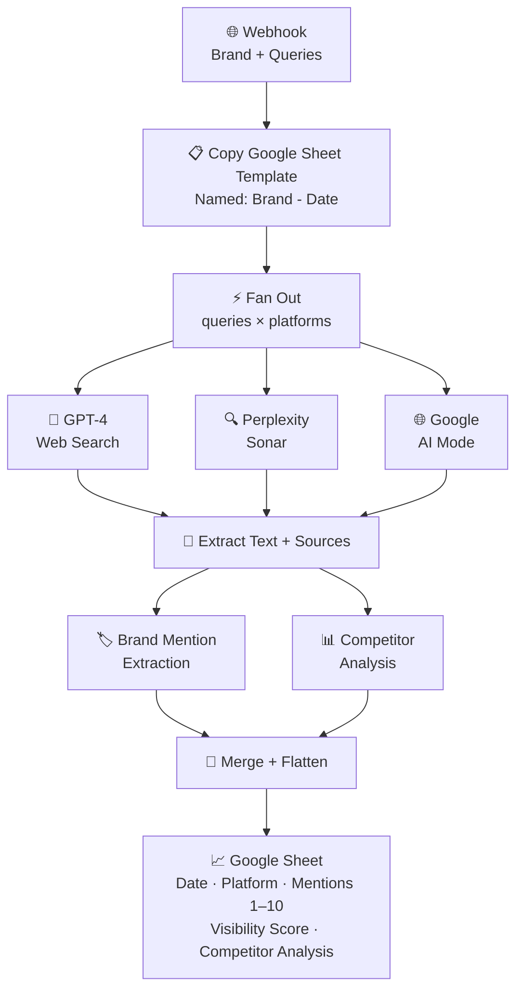
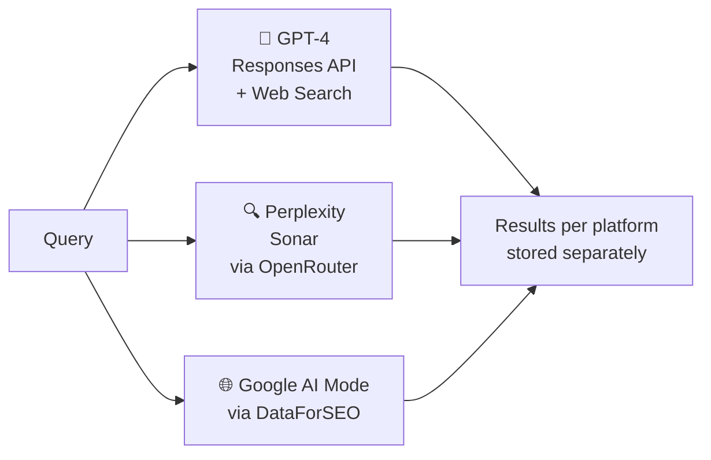

[README (1).md](https://github.com/user-attachments/files/28221818/README.1.md)
# AEO Visibility Suite

An end-to-end **Answer Engine Optimisation (AEO)** platform that tracks how brands appear across AI-powered search engines — GPT-4, Perplexity, and Google AI Mode — and delivers structured visibility reports automatically.

Built with N8n, OpenRouter, DataForSEO, and the OpenAI Responses API. Frontend is vanilla HTML/CSS/JS with PDF export.

---

## What It Does

Most brands have no idea whether they appear in AI-generated answers. Traditional SEO tools don't track this. This suite does.

You give it a brand name and a list of queries. It fires those queries across three AI platforms simultaneously, extracts every brand mention, scores visibility, runs competitor analysis, and writes everything to a branded Google Sheet — automatically, on a schedule or on demand.# AEO Visibility Suite

> Track how your brand appears in AI-generated answers across GPT-4, Perplexity, and Google AI Mode — automatically.

An end-to-end **Answer Engine Optimisation (AEO)** platform that fires queries across three AI search engines simultaneously, extracts brand mentions, scores visibility, runs competitor analysis, and delivers client-ready Google Sheet reports with zero manual work.

Built with N8n · OpenRouter · DataForSEO · OpenAI Responses API · Vanilla JS

---

## The Problem

```
Traditional SEO tracks Google rankings.
Nobody is tracking AI rankings.
```

When someone asks GPT-4 *"what's the best tool for X?"* — is your brand in the answer?
Most companies have no idea. This suite answers that question, at scale, automatically.

---

## How It Works



---

## Visibility Scoring

Each query result is scored based on where the brand appears relative to all mentioned competitors:

```
Score = (N - P + 1) × (100 / N)
```

| Variable | Meaning |
|---|---|
| `N` | Total brands mentioned in the AI response |
| `P` | Position of the first brand match |
| Score `100` | Brand mentioned first out of all competitors |
| Score `0` | Brand not mentioned at all |

---

## Platform Coverage



All three platforms run in parallel. Results are stored per-platform so you can compare where your brand is strongest and weakest across AI engines.

---

## Features

**Multi-platform tracking** — GPT-4, Perplexity Sonar, and Google AI Mode in one run

**Smart brand matching** — catches exact names, product variants (`Altenew Stampwheel` → `Altenew`), domain mentions (`altenew.com`), and minor typos

**Competitor analysis** — a dedicated LLM pass identifies who's ranking, why they rank, and what the target brand needs to do — delivered as a strategic prose paragraph per query

**Auto-branded reports** — each run copies a Google Sheets template named `{Brand} - {Date}` and populates it with all results, client-ready with no manual work

**PDF export** — the frontend includes cover page, section toggles, client name field, preview mode, and print orchestration

---

## Tech Stack

| Layer | Tools |
|---|---|
| Workflow automation | N8n (self-hosted on AWS EC2) |
| AI platforms | OpenAI GPT-4, Perplexity Sonar, Google AI Mode via DataForSEO |
| LLM analysis | OpenRouter — Gemini Flash |
| Storage | Google Sheets + Google Drive (auto-created per run) |
| Frontend | Vanilla HTML / CSS / JavaScript |
| Infra | AWS EC2, Slack error alerts, custom uptime monitoring |

---

## Frontend Pages

| Page | Description |
|---|---|
| `index.html` | Brand + query input, launches a scan |
| `dashboard.html` | Visibility scores per platform with segmented filter |
| `competitor-report.html` | Competitor ranking breakdown per query |
| `topical-relevance.html` | Topical gap analysis for content strategy |
| `website-categorization.html` | How AI engines categorise the brand's website |

All pages share `tokens.css` (design system), `state.js` (cross-page data), and `pdf-export.js` (report generation).

---

## Setup

### 1. Import the N8n Workflow

1. Import `aeo-visibility-suite.json` into your N8n instance
2. Add credentials:
   - OpenRouter API key
   - OpenAI API key
   - DataForSEO Basic Auth
   - Google Sheets OAuth2
   - Google Drive OAuth2
3. Set your Google Drive folder ID and template Sheet ID inside the workflow
4. Activate — the workflow exposes a POST webhook

### 2. Trigger a Scan

```json
POST your-n8n-webhook-url

{
  "Brand": "YourBrandName",
  "Query": [
    "best tools for X",
    "how to do Y",
    "top platforms for Z"
  ]
}
```

### 3. Run the Frontend

No build step. Open `index.html` directly in a browser or serve the folder statically.

---

## Output Schema

Each row in the generated Google Sheet = one **query × platform** combination:

| Column | Description |
|---|---|
| Date | Run date |
| Platform | `gpt` / `perplexity` / `ai_mode` |
| Query | The question asked |
| Mention 1–10 | Brands extracted in order of appearance |
| Visibility Score | Position-weighted score 0–100 |
| Brand Position | Where brand first appears |
| Competitor Analysis | Strategic prose paragraph |
| Sources / URLs | Citations from the AI response |

---

## Why This Exists

AI search is replacing traditional Google for product and brand discovery. Brands not appearing in GPT-4 or Perplexity answers are invisible to a growing segment of users — and no off-the-shelf tool tracked this when this was built.

---

## Author

Built by [Mehmood Bhutta](https://linkedin.com/in/mehmood-jb) — AI Automation Engineer specialising in N8n, LLM pipelines, and production-grade workflow systems.

[](https://github.com/MehmoodBhutta)
[](https://linkedin.com/in/mehmood-jb)


---

## Architecture

```
Webhook (Brand + Queries)
        │
        ▼
Copy Google Sheet Template  →  Named "{Brand} - {Date}"
        │
        ▼
Fan Out: queries × platforms (GPT / Perplexity / AI Mode)
        │
   ┌────┴────────────────┐
   ▼                     ▼                      ▼
GPT-4 Web Search    Perplexity Sonar     DataForSEO AI Mode
   │                     │                      │
   └────────────┬─────────────────────┘
                ▼
        Extract Text + Sources
                │
        ┌───────┴────────┐
        ▼                ▼
  Brand Mention      Competitor
  Extraction (LLM)   Analysis (LLM)
        │                │
        └───────┬─────────
                ▼
        Merge + Flatten
                │
                ▼
      Append to Google Sheet
      (Date, Platform, Query, Mentions 1–10,
       Visibility Score, Brand Position,
       Competitor Analysis, Sources)
```

---

## Features

**Multi-platform tracking**
Queries run across GPT-4 (with web search), Perplexity Sonar, and Google AI Mode in parallel. Results are stored per-platform so you can compare visibility across engines.

**Visibility Scoring**
Each result is scored using a position-weighted formula:
```
Score = (N - P + 1) × (100 / N)
```
Where N = total brands mentioned, P = position of first brand match. Higher score = stronger visibility.

**Smart Brand Matching**
The LLM extraction uses fuzzy matching logic — catches exact names, partial matches, product variants (e.g. "Altenew Stampwheel" → Altenew), domain mentions (altenew.com), and minor typos.

**Competitor Analysis**
A separate LLM pass identifies which competitors are mentioned, why they rank, and what the target brand needs to do to compete — delivered as a single strategic prose paragraph per query.

**Auto-branded Reports**
Each run copies a Google Sheets template, names it "{Brand} - {Date}", and populates it with all results. Client-ready without any manual work.

**PDF Export**
The frontend includes a shared PDF export module with cover page, section toggles, client name field, preview mode, and print orchestration.

---

## Tech Stack

| Layer | Tools |
|---|---|
| Workflow automation | N8n (self-hosted on AWS EC2) |
| AI platforms | OpenAI GPT-4 (Responses API), Perplexity Sonar via OpenRouter, Google AI Mode via DataForSEO |
| LLM analysis | OpenRouter (Gemini Flash for mention extraction + competitor analysis) |
| Storage | Google Sheets (auto-created per run), Google Drive |
| Frontend | Vanilla HTML / CSS / JavaScript |
| State management | localStorage via shared ToolState module |
| Infra | AWS EC2, custom uptime monitoring, Slack error alerts |

---

## Frontend Pages

| Page | Description |
|---|---|
| `index.html` | Brand + query input form, launches a scan |
| `dashboard.html` | Visibility scores per platform with segmented filter |
| `competitor-report.html` | Competitor ranking breakdown per query |
| `topical-relevance.html` | Topical gap analysis for content strategy |
| `website-categorization.html` | How AI engines categorise the brand's website |

All pages share a `tokens.css` design system, `state.js` for cross-page data passing, and `pdf-export.js` for report generation.

---

## Setup

### N8n Workflow

1. Import `aeo-suite-main.json` into your N8n instance
2. Add credentials:
   - OpenRouter API key
   - OpenAI API key
   - DataForSEO Basic Auth
   - Google Sheets OAuth2
   - Google Drive OAuth2
3. Set your Google Drive folder ID and template Sheet ID in the workflow
4. Activate the workflow — it exposes a POST webhook

### Webhook Payload

```json
{
  "Brand": "YourBrandName",
  "Query": [
    "best tools for X",
    "how to do Y",
    "top platforms for Z"
  ]
}
```

### Frontend

No build step. Open `index.html` in a browser or serve the folder statically. The frontend calls the N8n webhook directly and reads results from Google Sheets.

---

## Output (Google Sheets)

Each row represents one query × platform combination:

| Column | Description |
|---|---|
| Date | Run date |
| Platform | gpt / perplexity / ai_mode |
| Brand | Target brand |
| Query | The question asked |
| Raw Output | Full AI-generated answer |
| Mention 1–10 | Brands extracted in order of appearance |
| Visibility Score | Position-weighted score (0–100) |
| Brand Position | Where the brand first appears |
| Total Brands | How many brands were mentioned |
| Competitor Analysis | Strategic prose paragraph |
| Sources / URLs | Citations from the AI response |

---

## Why This Exists

AI search engines are replacing traditional Google for product and brand discovery. Brands that don't appear in GPT-4 or Perplexity answers are invisible to a growing segment of users. This tool gives marketing and SEO teams the data to track and improve that visibility — something no off-the-shelf tool provided when this was built.

---

## Author

Built by [Mehmood Bhutta](https://linkedin.com/in/mehmood-jb) — AI Automation Engineer specialising in N8n, LLM pipelines, and production-grade workflow systems.
